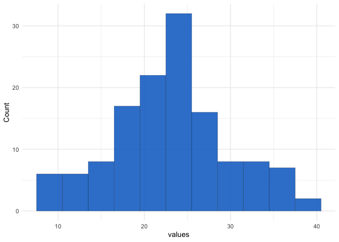
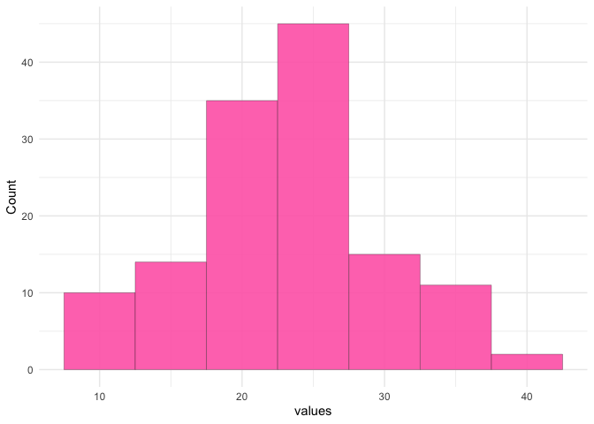

<!-- README.md is generated from README.Rmd. Please edit that file -->

# histomaker Package

<!-- badges: start -->

<!-- badges: end -->

The goal of histomaker is to easily plot a histogram using user-specified data and be able to change aesthetics efficiently!

## Installation

Package installation can be done directly by calling `devtools::install_github("stat545ubc-2025/histomaker")`

## Example

This is a basic example which shows you how to solve a common problem:

``` r
install_github("stat545ubc-2025/histomaker")`
library(histomaker)

# EXAMPLES USE REPRODUCIBLE RANDOM DATASET (BELOW)
set.seed(333)
random_data <- data.frame(id = 1:132, values = rnorm(n=132, mean = 23, sd = 7))

# EXAMPLE 1: NO AESTHETICS APPLIED
histo_function(random_data, values, 3)
```



``` r

# EXAMPLE 2: AESTHETICS APPLIED
histo_function(random_data, values, 5, fill_colour = "hotpink")
```


